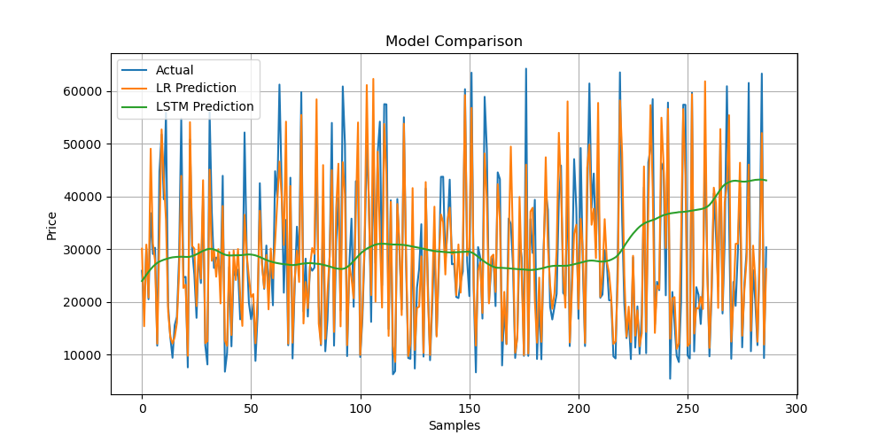

# Cryptocurrency Price Prediction

## 1. Problem Definition
Predict Bitcoin prices using Machine Learning and Deep Learning.

## 2. Data Collection
Data is collected using Yahoo Finance API.

## 3. Data Preprocessing
- Selected closing price
- Removed missing values

## 4. EDA
Visualized Bitcoin price trends.

## 5. Feature Engineering
Created future prediction column.

## 6. Train-Test Split
Split dataset into training and testing.

## 7. Models Used
- Linear Regression
- LSTM

## 8. Training
Models trained on historical price data.

## 9. Evaluation
Compared models using RMSE.

## 10. Results
- Linear Regression RMSE: 6365.0
- LSTM RMSE: 15782.9

LSTM captures the overall trend of the data, while Linear Regression shows high fluctuations. However, based on RMSE, Linear Regression performs better on this dataset.

## Run
pip install -r requirements.txt  
python main.py

##  Model Comparison
The plot compares actual Bitcoin prices with predictions from Linear Regression and LSTM models. While Linear Regression fluctuates significantly, LSTM provides smoother trend-based predictions.

